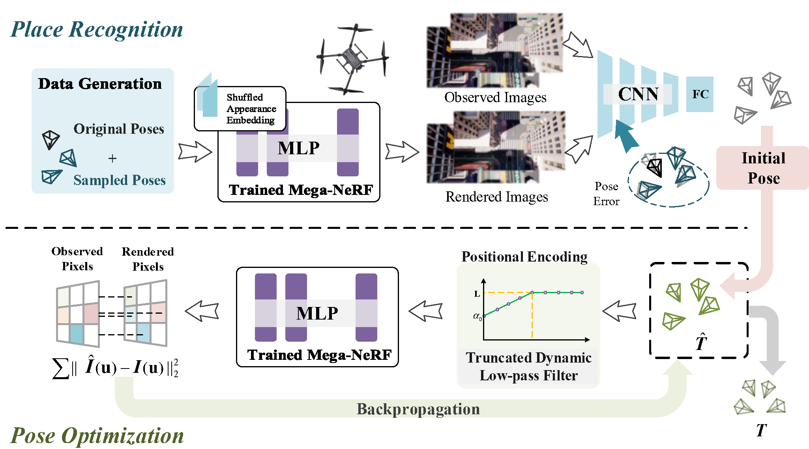

# LATITUDE(ICRA2023)
This is the official repository of [**LATITUDE: Robotic Global Localization with Truncated Dynamic Low-pass Filter in City-scale NeRF**](https://arxiv.org/abs/2209.08498).

* **Real world demo**

  

* **UMAD demo**

  

## Introduction



In this work, we present LATITUDE: Global Localization with Truncated Dynamic Low-pass Filter, which introduces a **two-stage localization mechanism** in large-scale NeRF. In **place recognition stage**, we train a regressor through images generated from trained NeRFs, which provides an initial value for global localization. In **pose optimization stage**, we minimize the residual between
the observed image and rendered image by directly optimizing the pose on the tangent plane. To avoid falling into local optimum, we introduce a **Truncated Dynamic Low-pass Filter (TDLF)** for coarse-to-fine pose registration. We evaluate our method on both synthetic and real-world data and show its potential applications for high-precision navigation in large-scale city scenes.

## Overview

This preliminary codebase currently only shows how to apply LATITUDE with mega-NeRF. However, it can work with the original NeRF as well.

* TODO:
  - [ ] Pose regressor
  - [x] Mega-nerf trainning
  - [x] UMAD dataset
  - [ ] Pose optimization

### Environment setup

Create a conda virtual environment and activate it.

```sh
conda env create -f environment.yml
conda activate latitude
```

### Prepare Dataset

* Mill 19
  
  * [Mill19 Link](https://github.com/cmusatyalab/mega-nerf#mill-19)

* UMAD

  * [百度云](https://pan.baidu.com/s/1UzD8iSuNw7qwfWmLg6o-Gw?pwd=iuwm)
  * [Google Drive](https://drive.google.com/drive/folders/1x97BXGGNWcLjTrL-Ls5fiJShF_EhyEJ-?usp=sharing)

### Training

The following will describe how to use **Mega-nerf** for training, you can refer to [cmusatyalab/mega-nerf](https://github.com/cmusatyalab/mega-nerf) for detailed usage instructions. You must use the code of this repository, for we make partial modifications to mega-nerf.
We will use the **UMAD dataset** as an example, assuming that you download the UMAD dataset at the following location:

```
datasets/
|-- high-simple($DATA_DIR)
|   |-- train
|       |-- metadata
|       |-- rgbs
|   |-- train
|       |-- metadata
|       |-- rgbs
|   |-- coordinates.pt
|   |-- mappings.txt
|-- high-hard
|-- ...
|
LATITUDE/ 
|-- inerf
|-- mega_nerf
|-- mega-nerf-output # files during training 
|-- test
|-- ...
```

### 1) Generate the training partitions for each submodule
```
python create_cluster_masks.py --config mega-nerf-output/configs/yaml/${DATASET_NAME}.yaml --dataset_path $DATASET_PATH  --output $MASK_PATH --grid_dim $GRID_X $GRID_Y
```

**Note:** In `${DATASET_NAME}.yml`, you should set `ray_altitude_range` according to your UAV height.

One example is:
```python
python create_cluster_masks.py --config mega-nerf-output/configs/yaml/high_simple.yaml --dataset_path ../dataset/high-simple --output mega-nerf-output/mask/high_simple --grid_dim 1 1
```

### 2) Train each submodule

```
python mega_nerf/train.py --config_file configs/mega-nerf/${DATASET_NAME}.yml --exp_name $EXP_PATH/$EXP_PREFIX-${SUBMODULE_INDEX} --dataset_path $DATASET_PATH --chunk_paths $SCRATCH_PATH --cluster_mask_path ${MASK_PATH}/${SUBMODULE_INDEX}
```
**Note:**  If there are multiple submodules, train each submodule separately, means change the value of `${SUBMODULE_INDEX}`. The last folder name of `$EXP_PATH` needs to be the same as `$EXP_PREFIX`.

One example is:
```python
python mega_nerf/train.py --config_file mega-nerf-output/configs/yaml/high_simple.yaml --exp_name mega-nerf-output/exp/high_simple/high_simple-0  --dataset_path ../dataset/high-simple --chunk_paths mega-nerf-output/chunk_dir --cluster_mask_path mega-nerf-output/mask/high_simple/0
```

### 3) Merge the trained submodules into a unified Mega-NeRF model
```
python merge_submodules.py --config_file configs/mega-nerf/${DATASET_NAME}.yaml  --ckpt_prefix ${EXP_PREFIX}- --centroid_path ${MASK_PATH}/params.pt --output $MERGED_OUTPUT
```

**Note:** Specify the `-ckpt_prefix` parameter as: `${EXP_PREFIX}-`, please note that there is a short horizontal bar after it.

One example is:
```python
python merge_submodules.py --config_file mega-nerf-output/configs/yaml/high_simple.yaml --ckpt_prefix mega-nerf-output/exp/high_simple/high_simple- --centroid_path mega-nerf-output/mask/high_simple/params.pt --output mega-nerf-output/merged/high_simple/high_simple.pt --ckpt_iteration 150000
```

### Pose Regressor


### Pose Optimization


## Bibtex

If this work is helpful for your research, please cite the following BibTeX entry.

```
@article{zhu2022latitude,
  title={LATITUDE: Robotic Global Localization with Truncated Dynamic Low-pass Filter in City-scale NeRF},
  author={Zhu, Zhenxin and Chen, Yuantao and Wu, Zirui and Hou, Chao and Shi, Yongliang and Li, Chuxuan and Li, Pengfei and Zhao, Hao and Zhou, Guyue},
  journal={arXiv preprint arXiv:2209.08498},
  year={2022}
}
```

## Contact

If you have any questions, please open a github issue or contact us.

Zhenxin Zhu: zhenxinzhu163@163.com, Yuantao Chen: yuantao@xauat.edu.cn, Zirui Wu: wuzirui@bit.edu.cn, Chao Hou: houchao@connect.hku.hk

## Acknowledgements

We would like to thank [mega-nerf](https://github.com/cmusatyalab/mega-nerf), [barf](https://github.com/chenhsuanlin/bundle-adjusting-NeRF) and [inerf](https://github.com/salykovaa/inerf) for making their project public.
